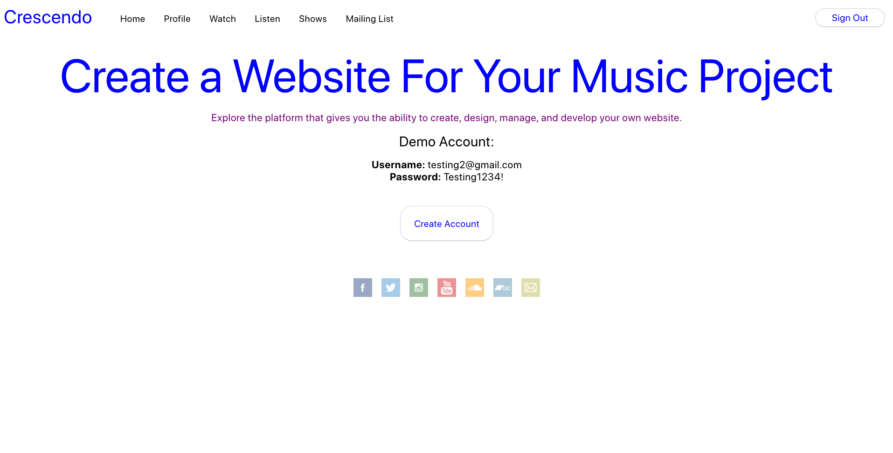
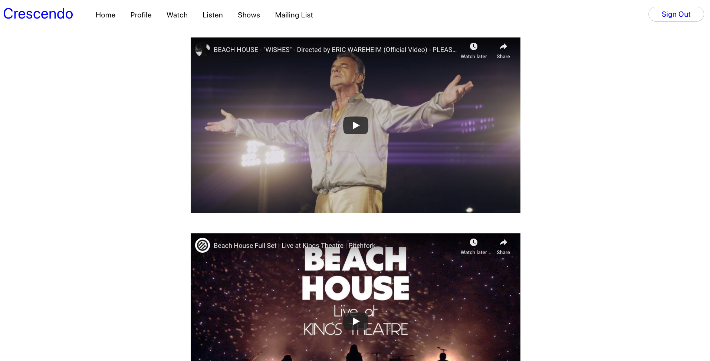
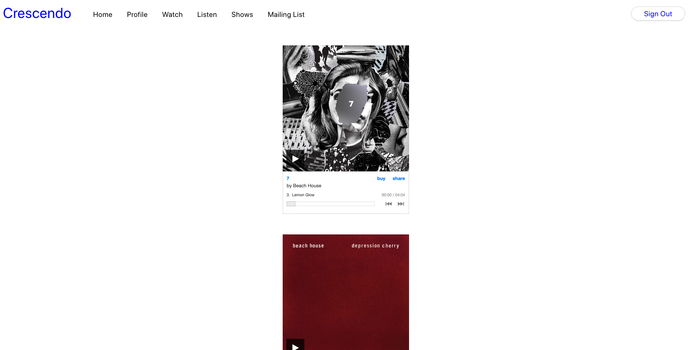
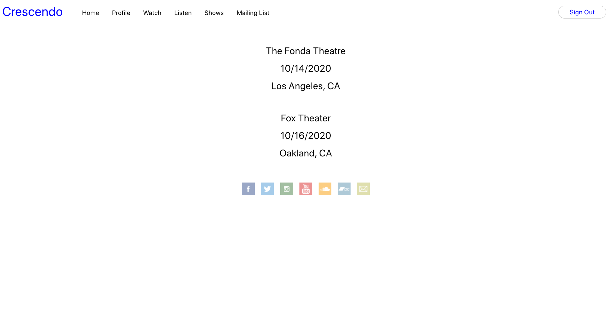

# Crescendo

https://crescendo.now.sh/

## App Summary

Crescendo is a fully responsive, full stack React app which gives musical artists the ability to create their own website. Fans of the artist can check out music videos, singles and albums, images, and upcoming shows. The app also enableds fans to subscribe to the artist's email list where they will be notified of upcoming shows, free downloads and more. I am expanding this application.

If you don't wish to create an account, and just play around, there are demo user credentials provided at the login page.

This app incorporates secure authentication and authorization practices.

## Technologies Used

JavaScript / React / CSS / Node.js / Express / PostreSQL (This repository is for the front end Javascript/React application and associted style sheets. Please see my 'crescendo-api' repository for the server files).

The Crescendo app uses React and is built with Zeit. It uses context to control state.

## Screenshots

### Landing Page:

### Login Page:

### Home Page:

### Watch Page:

### Listen Page:

### Shows Page:

